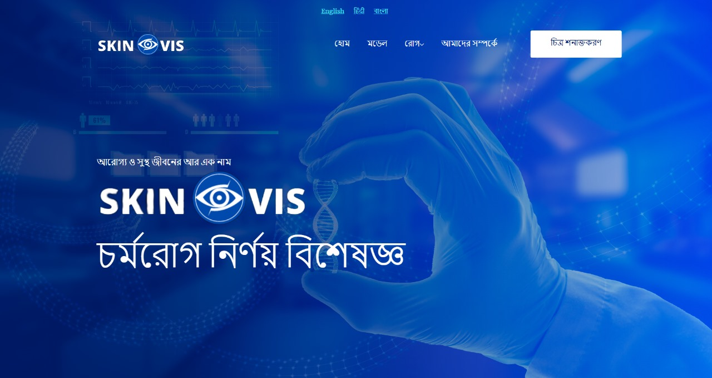

  

# Problem Statement
## AI-based tool for preliminary diagnosis of Dermatological manifestations

# Our Solution

# Our Vision
Our vision for this project is to bring about a paradigm shift in the landscape of skin cancer detection and prevention, making it accessible, accurate, and impactful for people from all walks of life. Skin cancer is a global health concern, and we are committed to leveraging technology to enhance early detection, improve patient outcomes, and contribute to public health on a broad scale.

### 1. Accessibility: 
Our project aims to make skin cancer detection accessible to all, regardless of geographic location or socioeconomic status.

### 2.Accuracy:
Accuracy is the cornerstone of our vision. We aspire to develop a system that boasts exceptional sensitivity and specificity, ensuring that potential skin cancer lesions are detected with precision while minimizing false alarms.

### 3.Innovation:
We envision constant innovation in machine learning and AI to enhance the accuracy and capabilities of our system continually.

### 4.Public Health Impact:
By empowering individuals, healthcare professionals, and communities with the tools and knowledge to detect skin cancer early, we aim to contribute significantly to public health and reduce the morbidity and mortality associated with skin cancer.

### 5.Privacy and Security:
We are committed to safeguarding users' sensitive health data and ensuring compliance with stringent data privacy regulations.

# Features

  

    <!-- Left column content -->
    <h3>🌟 Multi-Model Support:</h3>
    
By harnessing the power of advanced models like the Custom CNN, which achieves an outstanding accuracy rate of 90.25%, and the YOLOv8 model, boasting an 80% accuracy rate, our system excels in skin cancer detection. Elevating our accuracy even further, we employ a cutting-edge majority voting ensemble technique. This intelligent fusion of model predictions not only enhances our detection capabilities but also instills trust in the diagnostic process. As a result, we provide more precise assessments and personalized treatment recommendations, translating to improved patient outcomes and a significant positive impact on healthcare.

  

  

    <!-- Right column content (image) -->
    
  

  

    <!-- Left column content -->
    <h3>📊 Report Generation and EMAIL:</h3>
    
Report generation and email integration are indispensable elements of our skin cancer detection system. Report generation compiles detailed assessments, aiding healthcare professionals in treatment planning, patient records, and clear communication. Meanwhile, email integration enhances user engagement by providing timely notifications, convenient access to assessment results, and facilitating remote consultations. Together, these features promote early diagnosis, personalized treatment recommendations, and improved patient outcomes, ensuring a comprehensive and user-centric approach to skin health management.

  

  

    <!-- Right column content (image) -->
    
  

  

    <!-- Left column content -->
    <h3>🧠 LLAMA2 Based Query Assistant:</h3>
    
The language model integration in our skin cancer detection system acts as a versatile medical assistant, enhancing user interactions by enabling natural language queries. It promotes clarity in communication, accommodates users with varying expertise, empowers informed decisions, and boosts engagement in skin health monitoring.

  

  

    <!-- Right column content (image) -->
    
  

  

    <!-- Left column content -->
    <h3>🌍 Multi Language Support:</h3>
    
Multi-language support is crucial in our skin cancer detection system for several key reasons. It ensures inclusivity, breaks language barriers, and promotes accessibility for users of diverse linguistic backgrounds. Additionally, it enhances global reach, contributing to widespread early skin cancer detection. Most importantly, multi-language support empowers users to access vital skin health information, make informed decisions, and seek timely medical attention, ultimately improving public health outcomes worldwide.

  

  

    <!-- Right column content (image) -->
    
  

# 🌟 Demo Video
## *[Watch the Demo Video](https://www.veed.io/view/85bdbce1-de5e-45ea-af22-ecfd4b3e2a72?panel=share)*

# Technology Stack

<table style="font-size: 30px; border-collapse: collapse; width: 100%;">
  <tr style="background-color: #212A3E;">
    <th style="padding: 10px; text-align: left; border-bottom: 2px solid #ddd;">Category</th>
    <th style="padding: 10px; text-align: left; border-bottom: 2px solid #ddd;">Technologies</th>
  </tr>
  <tr>
    <td>Frontend</td>
    <td><strong>HTML</strong>, <strong>CSS</strong>, <strong>JavaScript</strong></td>
  </tr>
  <tr>
    <td>Backend</td>
    <td><strong>Python</strong>, <strong>Flask</strong>, <strong>Convolutional Neural Network (CNN)</strong>, <strong>YOLOv8</strong>, <strong>Ensemble Learning</strong></td>
  </tr>
</table>

# Future Scope

## 🎯 Instant Segmentation

We can implement targeted lesion segmentation. This approach involves identifying and segmenting the specific area where skin cancer or diseases are observed. By precisely isolating the affected regions, the system can provide more accurate and focused results, aiding in the early detection and treatment planning for skin cancer cases. Targeted lesion segmentation enhances the system's effectiveness and adaptability, ensuring that it can pinpoint and analyze areas of concern with precision.

## 🚀 Advanced Ensemble Techniques

We want to extend the use of ensemble learning techniques. Currently, the project utilizes ensemble methods for model predictions. In the future, consider incorporating more advanced ensemble techniques such as stacking, boosting, or bagging. These methods can further enhance model accuracy and robustness by combining the strengths of multiple models. Advanced ensemble techniques can lead to even more reliable and accurate skin cancer detection. They can effectively handle complex cases and provide more confidence in the system's diagnostic results, making it a valuable tool for healthcare professionals.

## 🧠 Incorporating More Models

We continuously expand the range of models used for skin cancer detection. We will include additional pre-trained models and experiment with custom architectures. We will consider incorporating models designed for specific skin cancer subtypes or skin conditions. A diverse set of models increases the system's ability to detect a wide variety of skin conditions accurately. It allows for better coverage of rare or less common skin cancers and ensures that the system remains up-to-date with the latest advancements in deep learning.

## 📊 Large Dataset Collection

We will invest in collecting and curating a larger and more diverse dataset of skin images. We can collaborate with healthcare institutions, dermatologists, and research organizations to accumulate high-quality images representing various skin types, ages, and ethnicities. We will augment the dataset with expert annotations. A larger and diverse dataset is the foundation of robust machine learning models. It enables the system to generalize better and detect skin cancer accurately across a broader spectrum of cases. Moreover, it fosters the development of models that are more resilient to real-world variations in skin appearances.

#

## 🚀 Team Members

- 🌟 **Sambit Mallick**
- 🌟 **Snigdha Paul**
- 🌟 **Arpita Mondol**
- 🌟 **Chitradeep Saha**
- 🌟 **Sayandeep Mallick**
- 🌟 **Shayamsundar Rajbanshi**

## 👥 Our Mentors

- 👨‍🏫 **Anindya Sen**
- 👨‍🏫 **Shibsankar Bhowmick**

#
